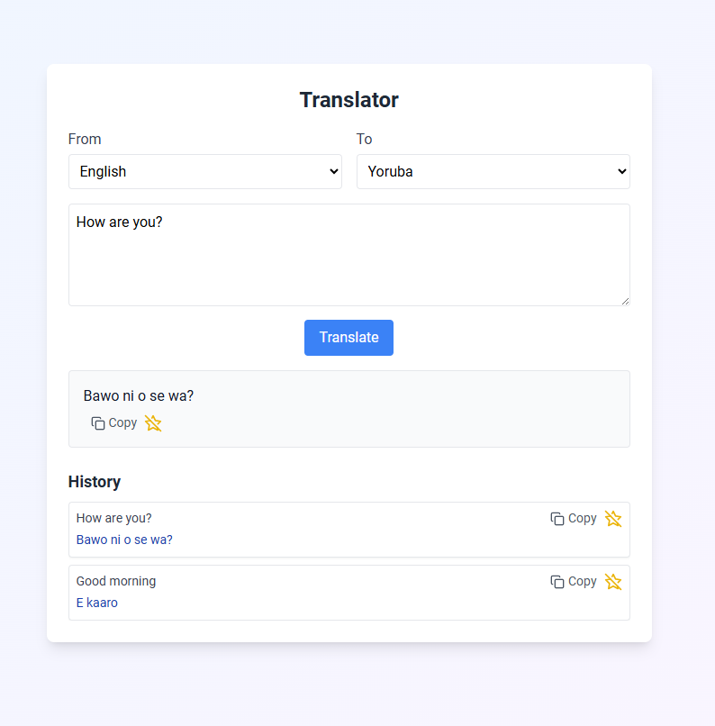

<div align="center">

<h1>🌍 My Translation App</h1>

<p>
  A responsive, bilingual translation web-app built with
  <strong>Vite + React 18 + Tailwind CSS</strong>.<br>
  Default pair: <strong>English ⇄ Yoruba</strong>,
  but users can choose any of Google’s 100 + languages.
</p>



<p>
  <a href="https://translationapp-kappa.vercel.app"><strong>Live Demo →</strong></a>
</p>

</div>

---

## ✨ Features

| UI nicety           | Description                                                  |
| ------------------- | ------------------------------------------------------------ |
| 🎛️ Language pickers | Dynamic dropdown from Google’s `/languages` endpoint         |
| ⌨️ Real-time input  | Auto-focus textarea with tailwind focus-rings                |
| 🔄 History log      | Persists to `localStorage`, includes copy & favorite toggles |
| ⭐ Favorites        | One-click save, filterable list                              |
| 📋 Copy button      | Uses Clipboard API + toast “Copied!”                         |
| 🍞 Toast feedback   | `react-hot-toast` success / error pop-ups                    |
| 🔒 Key restrictions | Example CORS + HTTP-referrer restriction guide               |

---

## 🚀 Quick-Start

```bash
# 1. Clone
git clone https://github.com/YOUR-USER/my-translation-app.git
cd my-translation-app
```

```bash
# 2. Install deps
npm install
```

```bash
# 3. Add env var
echo \"VITE_GOOGLE_API_KEY=YOUR_KEY\" > .env
```

```bash
# 4. Dev server
npm run dev
```

| **Script**        | **Purpose**                             |
| ----------------- | --------------------------------------- |
| `npm run dev`     | Vite dev-server @ http://localhost:5173 |
| `npm run build`   | Production bundle (/dist)               |
| `npm run preview` | Preview built output                    |

---

## 🗂️ Folder Structure

```bash
├── public/
│ └── favicon.ico
├── src/
│ ├── components/ # Stateless UI pieces
│ ├── constants/ # googleLanguages.js
│ ├── styles/ # Tailwind entry
│ ├── App.jsx
│ └── main.jsx
├── docs/ # Assignment documentation
├── .env.example
└── vite.config.js
```

---

## 🔑 Environment Variables

| **Key**               | **Description**                                                                    |
| --------------------- | ---------------------------------------------------------------------------------- |
| `VITE_GOOGLE_API_KEY` | Google Cloud Translation API key (see /docs/API_Documentation.md#how-to-get-a-key) |

---

## 🤝 Contributing

Fork → create feature branch → PR.

Run npm run lint and add tests if applicable.

Describe your change clearly—thanks!

---

## 📝 License

MIT © 2025 Kachi Osuji
